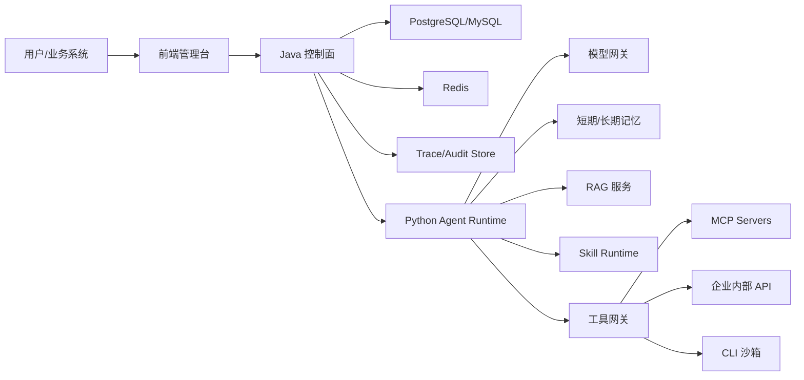
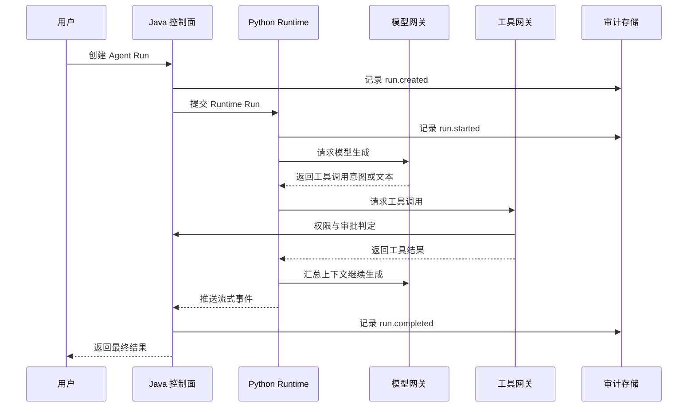

# 架构总览

## 架构定位

平台采用混合架构：

- Java 控制面负责企业治理、配置、权限、任务、审计和平台 API。
- Python Runtime 负责 Agent 执行、模型调用、工具选择、RAG、记忆、Skill 和 CLI 沙箱接入。
- 前端提供 Agent 管理台、运行台、工具管理、知识库、记忆管理、审计与评测视图。

## 总体架构

## 子系统职责

| 子系统 | 技术默认 | 职责 |
|---|---|---|
| 前端管理台 | Vue 3 | Agent 配置、运行、工具、知识库、记忆、审计和评测展示 |
| 控制面 API | Java / Spring Boot | 用户、租户、权限、Agent 配置、任务管理、工具注册、审批、审计 |
| Agent Runtime | Python / FastAPI | Agent Loop、模型调用、工具编排、短期记忆、RAG、Skill、CLI 适配 |
| 模型网关 | Python Runtime 内部模块起步 | 模型适配、路由、Token 统计、重试、成本记录 |
| 工具网关 | Java 控制面 + Python Adapter | 工具注册、权限判定、参数校验、执行代理、审计 |
| 记忆服务 | PostgreSQL/Redis/向量库 | 会话记忆、长期记忆、召回、删除、冲突记录 |
| RAG 服务 | Python Runtime 内部模块起步 | 文档导入、切分、Embedding、检索、Rerank、引用 |
| 审计与观测 | 控制面持久化 | Trace、事件、错误、成本、回放数据 |

## 控制面与执行面边界

控制面保存“应该发生什么”和“是否允许发生”，Runtime 执行“如何完成任务”。

| 边界 | 控制面 | Runtime |
|---|---|---|
| Agent 配置 | 存储、版本、启停 | 加载执行快照 |
| 权限 | 用户、角色、Agent 身份、工具权限 | 请求授权结果，不自行放权 |
| 工具 | 注册、审批、审计、执行代理 | 选择工具、构造参数、等待结果 |
| 记忆 | 记忆策略、用户管理、审计 | 召回、写入候选、上下文注入 |
| RAG | 知识库配置、权限、任务记录 | 检索、重排、引用组装 |
| CLI | 策略、审批、审计 | 沙箱内执行受控命令 |

## 默认安全策略

1. Runtime 不直接连接企业核心系统，必须通过工具网关或受控 MCP Server。
2. 写操作工具默认需要审批，危险工具默认禁用。
3. CLI 能力在阶段 6 前不开放给 Agent 使用。
4. 每个 Agent Run 必须有 `traceId`、`runId`、`tenantId`、`userId`、`agentId`。
5. 所有模型调用、工具调用、RAG 检索、记忆读写都必须产生事件。

## 一次运行主链路

